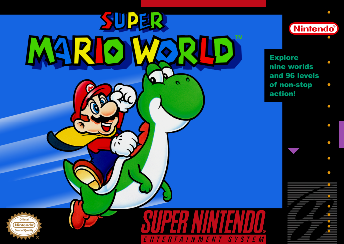
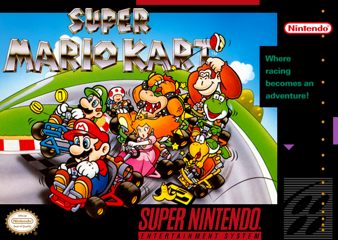
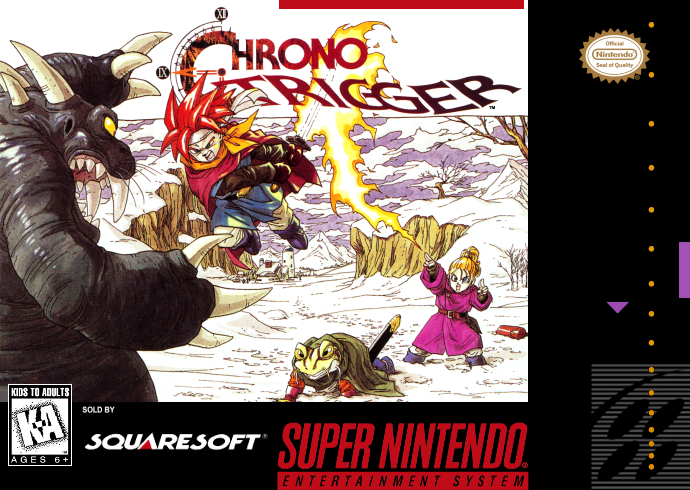
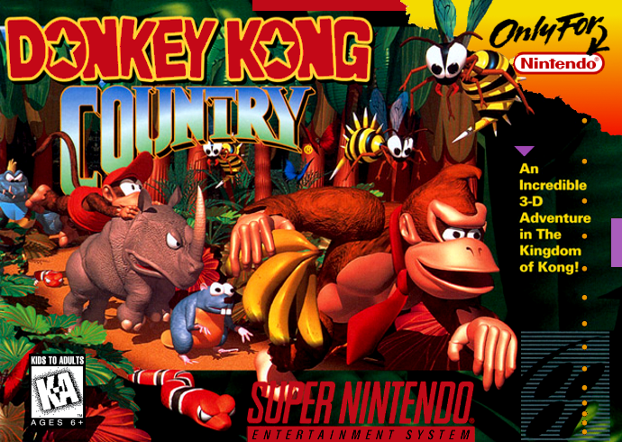
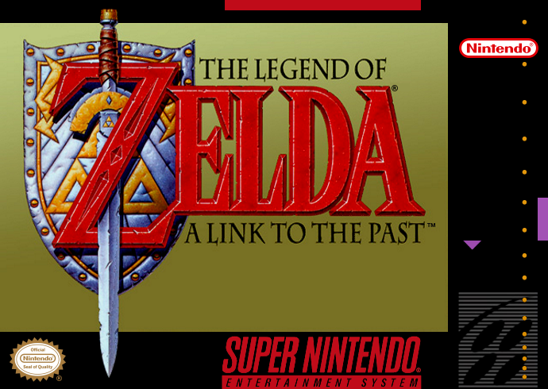

<div align="center">
  

  ### 🎮 Emulador Web para Super Nintendo

  [](https://snes.dellabeneta.io)

  <p>
    <a href="#features">Features</a> •
    <a href="#tech-stack">Tecnologias</a> •
    <a href="#como-jogar">Como Jogar</a> •
    <a href="#cloud-hospedagem">Hospedagem</a>

</div>

## Features

- **Nostalgia Pura**: Interface inspirada no design clássico do SNES com paleta de cores autêntica e efeitos de *scanlines* CRT no fundo.
- **EmulatorJS Integrado**: Poderoso motor de emulação (RetroArch Web) rodando no client-side para máxima performance.
- **Cadeado HTTPS & Segurança**: Preparado para Cloudflare S3, permitindo "Contexto Seguro" para destravar APIs de navegadores modernos.
- **Suporte a Gamepad**: Conecte seu controle Xbox, PlayStation ou genérico via USB/Bluetooth e jogue como nos velhos tempos!
- **Navegação Dinâmica**: Use o mouse, teclado ou setinhas para navegar no grid de jogos de forma super responsiva.
- **Save States**: Sistema nativo de salvamento e carregamento de progresso usando o banco de dados interno do navegador.
- **Filtros Gráficos**: Suporte a dezenas de filtros visuais originais, incluindo simulações fiéis de TV de Tubo (CRT).

## Tech Stack

- **HTML5 & CSS3**: Estruturada semanticamente com estilização puramente Vanilla, dispensando frameworks pesados. Efeitos criados à mão usando `linear-gradient` e caixas flexíveis (`flexbox`/`grid`).
- **Vanilla JavaScript**: Lógica de interface de usuário (UI), navegação em grade e hooks de eventos da emulação.
- **EmulatorJS**: Core do sistema (`snes`), carregado dinamicamente via CDN.
- **AWS S3 & Cloudflare**: Arquitetura padrão ideal para o deploy. Hospedagem estática com cache em borda.

## Como Jogar

O projeto é muito simples de rodar, pois se baseia numa arquitetura 100% estática (Serverless).

1. Clone esse repositório na sua máquina:
   ```bash
   git clone https://github.com/dellabeneta/snes.dellabeneta.io.git
   ```
2. Adicione os seus arquivos de ROMs (arquivos `.sfc` ou `.smc`) dentro do diretório `/roms`. *Tenha certeza que os nomes batem com os mapeados em `script.js`*.
3. Use qualquer servidor local ou extensão (como o Live Server do VSCode) para hospedar a raiz do projeto.
   ```bash
   # Exemplo com Python 3
   python3 -m http.server 8000
   ```
4. Acesse `http://localhost:8000` e divirta-se!

> **Nota**: Se estiver hospedando remotamente em cloud, não esqueça de configurar um certificado **SSL (HTTPS)** para que a API de Gamepad do seu navegador seja desbloqueada pela política de *"Secure Context"*.

## O Projeto em Ação

O visual foca numa grelha (Grid Layout) com expansão fluída. Quando acionado, o emulador assume o modo Modal e te leva de volta para os anos 90!

<div align="center">
    
    
    
    
</div>

<br>

<p align="center">Criado com ☕ por Dellabeneta.</p>
